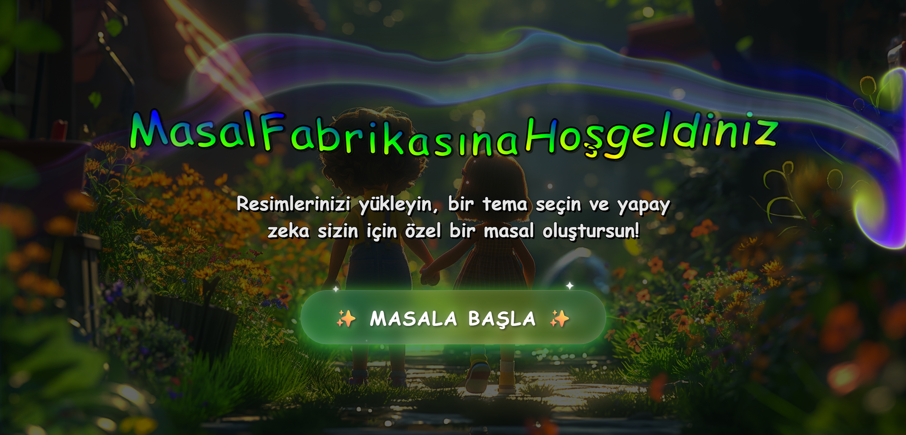
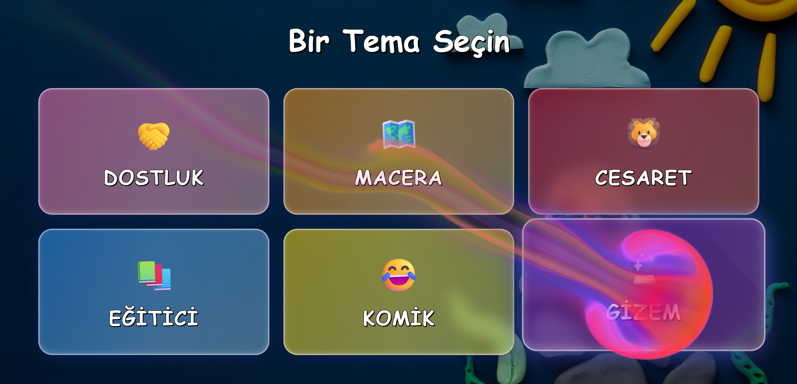
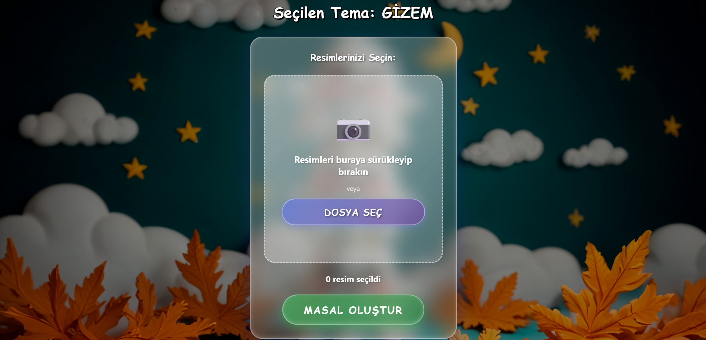
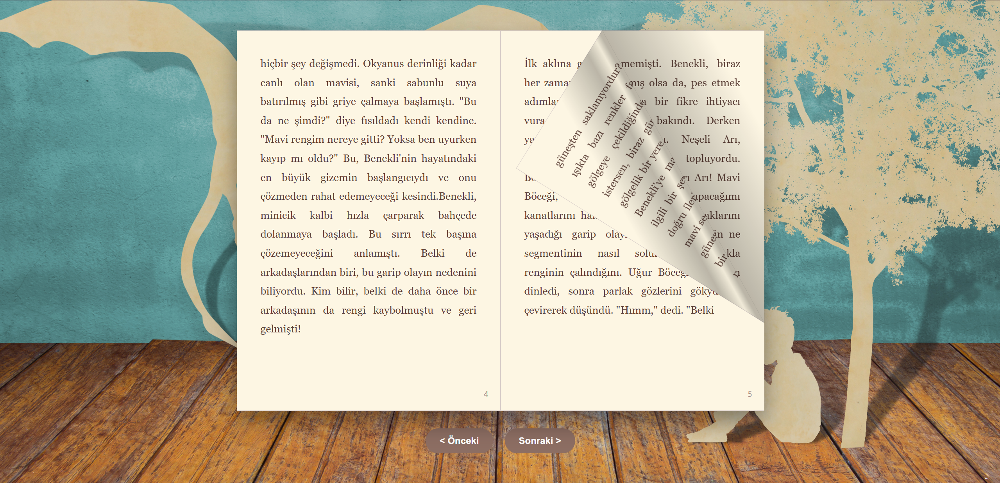

# 📚 Masal Fabrikası — AI Destekli Kişiselleştirilmiş Çocuk Masalları

<p align="left">
  <a href="https://burakyucelpy.github.io/MasalFabrikasi">
    
  </a>
  <a href="https://masalfabrikasi.onrender.com">
    
  </a>
</p>

> Çocukların yüklediği resimlerden, yapay zeka ile kişiselleştirilmiş, eğitici ve eğlenceli masallar üretir.

## 📋 Proje Hakkında

**Masal Fabrikası**; çocukların kendi fotoğraflarını veya sevdikleri görselleri yükleyerek, seçtikleri temaya göre (Macera, Dostluk, Komik, vb.) yapay zeka destekli özgün masallar oluşturabilecekleri bir web uygulamasıdır. Oluşturulan masallar, dijital kitap formatında sayfa sayfa okunabilir.

- **Frontend**: React + React Router DOM + React PageFlip
- **Backend**: FastAPI + Python
- **AI Modeli**: Google Gemini 2.5 Flash (Multimodal)
- **Özellikler**: 
  - Tema seçimi (Macera, Dostluk, Komik, Eğitici, Fantastik)
  - Resim önizleme ve silme
  - Yükleme animasyonu
  - Flipbook tarzı kitap görünümü
  - Splash efektleri

## 🌐 Canlı Demo

Projeyi tarayıcıdan deneyin: **https://burakyucelpy.github.io/MasalFabrikasi**

## 🖼️ Ekran Görüntüleri

<p align="center">
  <br/>
  <em>Hoşgeldin Sayfası</em>
</p>

<p align="center">
  <br/>
  <em>Tema Seçimi Ekranı</em>
</p>

<p align="center">
  <br/>
  <em>Masal Oluşturma Sayfası</em>
</p>

<p align="center">
  <br/>
  <em>Yükleme Animasyonu</em>
</p>

<p align="center">
  <br/>
  <em>Dijital Kitap Kapağı</em>
</p>

<p align="center">
  <br/>
  <em>Dijital Kitap İçeriği</em>
</p>

<p align="center">
  <br/>
  <em>Dijital Kitap Son Sayfası</em>
</p>

## 🛠️ Kullanılan Teknolojiler

### Frontend

| Teknoloji | Açıklama |
|-----------|----------|
| **React** | Kullanıcı arayüzü oluşturma |
| **React Router DOM** | Sayfa yönlendirme (HashRouter) |
| **React PageFlip** | Flipbook efekti |
| **Axios** | HTTP istekleri |
| **CSS3** | Animasyonlar ve stil |

### Backend

| Teknoloji | Açıklama |
|-----------|----------|
| **FastAPI** | Modern Python web framework |
| **Uvicorn** | ASGI sunucusu |
| **Google Gemini API** | Multimodal AI (gemini-2.5-flash) |
| **Pillow** | Resim işleme |
| **python-dotenv** | Çevre değişkenleri yönetimi |

### Deployment

| Platform | Kullanım |
|----------|---------|
| **GitHub Pages** | Frontend hosting |
| **Render** | Backend hosting (Free tier) |

## 🚀 Kurulum

### Gereksinimler

- **Node.js** (v16+)
- **Python** (3.8+)
- **Google Gemini API Key**

### 1) Depoyu Klonlayın

```bash
git clone https://github.com/BurakYucelPY/MasalFabrikasi.git
cd MasalFabrikasi
```

### 2) Backend Kurulumu

```bash
# Gerekli paketleri yükle
pip install -r requirements.txt

# .env dosyası oluştur ve API anahtarını ekle
echo GEMINI_API_KEY=your_api_key_here > .env

# Backend'i başlat
uvicorn api:app --reload
```

Backend `http://localhost:8000` adresinde çalışacaktır.

### 3) Frontend Kurulumu

```bash
cd masal-frontend

# Bağımlılıkları yükle
npm install

# Development sunucusunu başlat
npm start
```

Frontend `http://localhost:3000/MasalFabrikasi` adresinde çalışacaktır.

## 📁 Proje Yapısı

```
MasalFabrikasi/
├─ api.py                           # FastAPI backend
├─ fonks/
│  └─ masal_yarat.py                # Masal üretim fonksiyonu (4 aşamalı chaining)
├─ masal-frontend/
│  ├─ src/
│  │  ├─ components/
│  │  │  ├─ FlipBook.js             # Dijital kitap componenti
│  │  │  ├─ LoadingSpinner.js       # Yükleme animasyonu
│  │  │  └─ SplashCursor.js         # Mouse efekti
│  │  ├─ pages/
│  │  │  ├─ Hosgeldin.js            # Karşılama sayfası
│  │  │  ├─ TemaSecimi.js           # Tema seçim sayfası
│  │  │  ├─ MasalOlustur.js         # Resim yükleme sayfası
│  │  │  └─ MasalGoster.js          # Masal görüntüleme sayfası
│  │  ├─ images/                    # Arka plan görselleri
│  │  └─ App.js                     # Ana uygulama
│  └─ package.json
├─ imagesReadMe/                    # README görselleri
├─ .env                             # API anahtarları (git'e eklenmez)
├─ .gitignore
├─ requirements.txt
└─ README.md
```

## 💡 Nasıl Çalışır?

### 1. **Tema Seçimi**
Kullanıcı, masalının hangi temada olacağını seçer (Macera, Dostluk, Komik, Eğitici, Fantastik).

### 2. **Resim Yükleme**
Kullanıcı bir veya daha fazla resim yükler. Yüklenen resimler küçük önizlemeler halinde gösterilir ve istenirse silinebilir.

### 3. **AI ile Masal Üretimi (4 Aşamalı Chaining)**
Backend'de `masal_yarat.py` fonksiyonu şu adımları izler:

- **1. Kurgu Oluşturma**: Gemini API'ye resimler ve tema gönderilir, hikayenin ana hatları belirlenir.
- **2. Giriş Bölümü**: Kurguya uygun detaylı giriş paragrafları yazılır.
- **3. Gelişme Bölümü**: Hikayenin ortası, kurguya sadık kalınarak genişletilir.
- **4. Sonuç Bölümü**: Hikaye tamamlanır, tema mesajı verilir.
- **5. Başlık Üretimi**: Tüm masaldan sonra, çocuklar için akılda kalıcı bir başlık oluşturulur.

### 4. **Dijital Kitap Görünümü**
Oluşturulan masal, `react-pageflip` kütüphanesi ile dijital kitap formatında sunulur. Kullanıcı sayfaları çevirerek okuyabilir.

## 🎯 Örnek Kullanım Senaryosu

1. Çocuk uygulamaya girer ve **"Başlayalım!"** butonuna tıklar.
2. **Macera** temasını seçer.
3. Kendi fotoğrafını ve köpeğinin resmini yükler.
4. **"Masal Oluştur"** butonuna basar.
5. Gökkuşağı animasyonlu yükleme ekranı görünür.
6. 30-60 saniye içinde, çocuğun ve köpeğinin kahramanı olduğu özgün bir macera masalı oluşur.
7. Masalı dijital kitap formatında sayfa sayfa okur.

## ⚙️ Önemli Ayarlar

### Backend (api.py)

- **CORS**: GitHub Pages ve localhost için izinler tanımlı.
- **Model**: `gemini-2.5-flash` (multimodal)
- **Endpoint**: `/masal-uret` (POST)

### Frontend

- **Router**: `HashRouter` (GitHub Pages uyumlu)
- **Base URL**: `/MasalFabrikasi`
- **API URL**: `https://masalfabrikasi.onrender.com`

## 🧪 Geliştirme İpuçları

- **Local Test**: Backend ve frontend'i aynı anda çalıştırarak `localhost` üzerinde test edebilirsiniz.
- **Deploy**: 
  - Frontend için: `npm run deploy`
  - Backend için: Render otomatik deploy yapar (GitHub push sonrası)
- **Resim Boyutu**: Gemini API, resim boyutlarında sınırlama olabilir. Çok büyük resimlerde hata alınırsa resim boyutunu küçültün.

## 🐛 Sorun Giderme

| Sorun | Çözüm |
|-------|-------|
| **Network Error** | Backend'in aktif olduğundan emin olun (Render free tier 15 dk sonra uyur). |
| **CORS Hatası** | `api.py` içinde `allow_origins` listesine frontend URL'inizi ekleyin. |
| **Loading Animasyonu Görünmüyor** | `LoadingSpinner.css` içinde `z-index` yeterince yüksek mi kontrol edin. |
| **Masal Oluşmadı** | Gemini API Key'inizin geçerli ve `.env` dosyasında doğru yazıldığından emin olun. |
| **Flipbook Bozuk** | `react-pageflip` versiyonunu kontrol edin, tarayıcı önbelleğini temizleyin. |

## 📌 Notlar

- **Ücretsiz Hosting**: Render free tier'da backend 15 dakika hareketsizlikten sonra uyur. İlk istekte 30-60 saniye bekleyebilirsiniz.
- **API Limitleri**: Google Gemini API'nin ücretsiz limitlerini aşmamanız önerilir.
- **Çocuk Güvenliği**: Yüklenen resimler sadece AI'ya gönderilir, sunucuda saklanmaz.
- **Eğitici İçerik**: Masallar, seçilen temaya uygun öğretici mesajlar içerir.

## 🎨 Özelleştirme

- **Yeni Temalar Ekleme**: `TemaSecimi.js` içinde yeni tema kartları ekleyebilirsiniz.
- **Görsel Değişiklik**: `src/images/` klasörüne yeni arka plan görselleri ekleyerek sayfaları özelleştirebilirsiniz.
- **Masal Uzunluğu**: `masal_yarat.py` içindeki prompt'larda kelime sayısı kısıtlarını değiştirebilirsiniz.

## 📄 Lisans

Bu proje eğitim amaçlıdır ve açık kaynaklıdır. Kendi projelerinizde kullanabilirsiniz.

---

**Geliştirildi**: Burak Yücel
